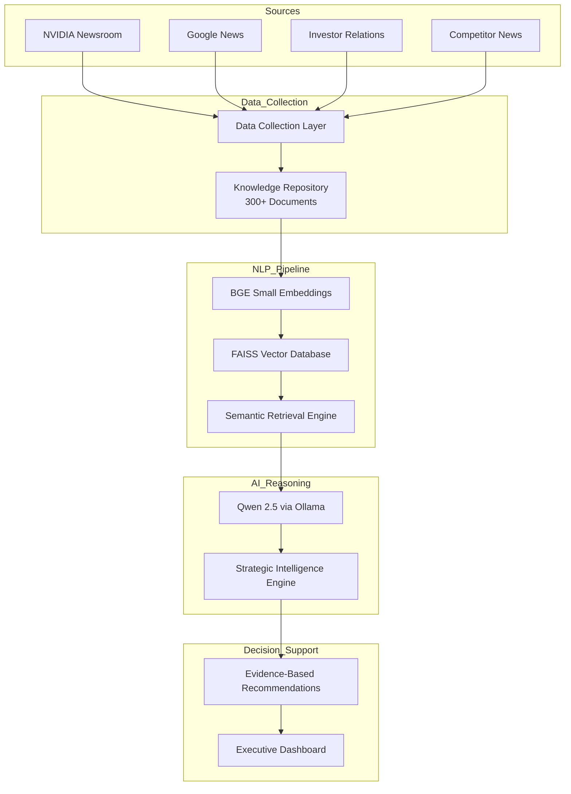
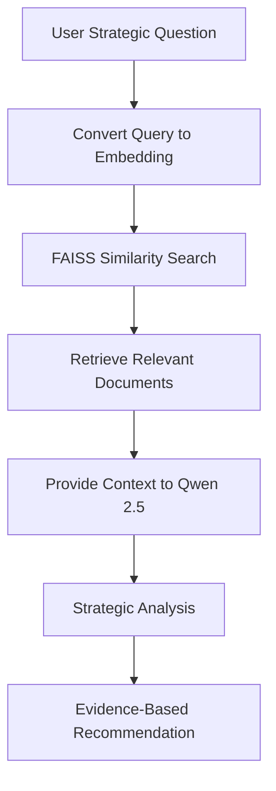

# 🚀 NVIDIA AI CEO Strategic Intelligence Agent

<div align="center">


### 🎓 Master's Final Examination Project

# NVIDIA AI CEO Strategic Intelligence Agent

### AI-Powered Executive Decision Support System

Transforming Industry Intelligence into Evidence-Based Strategic Recommendations

</div>

---

# 📌 Project Overview

Modern organizations face information overload from:

* 📰 Industry News
* 📈 Investor Relations Announcements
* 🤝 Strategic Partnerships
* ⚔️ Competitor Activities
* 🧠 Emerging Technologies

This project develops an **AI-Powered Strategic Intelligence Agent** that automatically gathers intelligence, builds a knowledge repository, performs semantic retrieval, and generates executive-level recommendations using NLP, RAG, Vector Search, and Large Language Models.

---

# 🎯 Project Objectives

| 🎯 Objective           | 📖 Description                                           |
| ---------------------- | -------------------------------------------------------- |
| Information Collection | Gather NVIDIA-related intelligence from multiple sources |
| Knowledge Repository   | Build a searchable intelligence database                 |
| Semantic Retrieval     | Retrieve relevant information using embeddings           |
| Strategic Analysis     | Generate executive-level insights                        |
| Recommendations        | Produce evidence-based recommendations                   |
| Executive Dashboard    | Provide an interactive decision-support platform         |

---

# 🏗️ System Architecture



---

# 🔄 Retrieval-Augmented Generation (RAG) Workflow



---

# 🛠️ Technology Stack

| Layer                | Technology Used                     |
| -------------------- | ----------------------------------- |
| Programming Language | Python                              |
| Dashboard Framework  | Streamlit                           |
| Data Processing      | Pandas                              |
| Data Collection      | Feedparser, Requests, BeautifulSoup |
| Embedding Model      | BAAI/bge-small-en-v1.5              |
| Vector Database      | FAISS                               |
| Retrieval System     | Semantic Similarity Search          |
| Large Language Model | Qwen 2.5                            |
| Local Inference      | Ollama                              |
| Version Control      | Git & GitHub                        |

---

# 📂 Project Structure

```text
ai-ceo-agent/
│
├── collectors/
│   ├── nvidia_collector.py
│   ├── nvidia_google_news.py
│   ├── competitor_news.py
│   ├── nvidia_ir_collector.py
│   └── merge_data.py
│
├── embeddings/
│   └── embed.py
│
├── rag/
│   ├── build_index.py
│   └── retrieve.py
│
├── intelligence/
│   ├── strategic_engine.py
│   └── recommendations.py
│
├── dashboard/
│   └── app.py
│
├── data/
│   ├── raw/
│   └── processed/
│
├── requirements.txt
└── README.md
```

---

# 📊 Data Sources

| Source             | Intelligence Type                      |
| ------------------ | -------------------------------------- |
| NVIDIA Newsroom    | Product announcements and partnerships |
| Investor Relations | Corporate and financial intelligence   |
| Google News        | Industry and market developments       |
| Competitor News    | Competitive intelligence               |

---

# 📈 Dataset Statistics

| Metric               | Value     |
| -------------------- | --------- |
| Documents Collected  | 300+      |
| Data Sources         | 4         |
| Embedding Model      | BGE Small |
| Embedding Dimensions | 384       |
| Vector Database      | FAISS     |
| LLM                  | Qwen 2.5  |
| Dashboard            | Streamlit |

---

# 🧠 NLP Concepts Implemented

| NLP Concept                          | Purpose in Project                      |
| ------------------------------------ | --------------------------------------- |
| Data Cleaning                        | Prepare collected intelligence          |
| Information Extraction               | Extract titles and relevant content     |
| Embeddings                           | Convert text into vectors               |
| Semantic Search                      | Retrieve similar documents              |
| Information Retrieval                | Search knowledge repository             |
| Vector Databases                     | Store embeddings in FAISS               |
| Retrieval-Augmented Generation (RAG) | Ground LLM responses in evidence        |
| Large Language Models                | Strategic reasoning and recommendations |
| Sentiment Analysis                   | Analyze news sentiment                  |

---

# 📋 Information Processing Pipeline

The system automatically:

✅ Collects intelligence from multiple sources

✅ Cleans and preprocesses data

✅ Removes duplicate documents

✅ Extracts relevant information

✅ Generates semantic embeddings

✅ Indexes embeddings in FAISS

✅ Retrieves context using semantic similarity

✅ Generates strategic insights and recommendations

---

# 📊 Executive Intelligence Dashboard

The dashboard contains seven executive-level modules.

## 1️⃣ Company Overview

* Company Name
* Industry
* Number of Documents
* Number of Sources
* Last Update Timestamp

## 2️⃣ Market Intelligence

* Recent News
* Competitor Activities
* Emerging Technologies
* Company Announcements

## 3️⃣ Opportunity Monitor

| Field               | Description              |
| ------------------- | ------------------------ |
| Opportunity Title   | Strategic opportunity    |
| Impact Level        | High / Medium / Low      |
| Supporting Evidence | Evidence from repository |
| Confidence Score    | AI-generated confidence  |

## 4️⃣ Risk Monitor

| Field               | Description                         |
| ------------------- | ----------------------------------- |
| Risk Title          | Identified risk                     |
| Risk Category       | Strategic / Competitive / Financial |
| Severity Level      | High / Medium / Low                 |
| Supporting Evidence | Evidence from repository            |
| Confidence Score    | AI-generated confidence             |

## 5️⃣ Sentiment Analysis

* News Sentiment
* Public Sentiment
* Sentiment Trends
* Visual Analytics

## 6️⃣ Strategic Recommendations

| Component           | Description            |
| ------------------- | ---------------------- |
| Recommendation      | Suggested action       |
| Priority            | High / Medium / Low    |
| Supporting Evidence | Retrieved intelligence |
| Expected Impact     | Business impact        |
| Risk Assessment     | Potential risks        |

## 7️⃣ CEO Briefing

Executive summary answering:

* What happened?
* Why does it matter?
* What should management do next?

---

# 🎯 Strategic Intelligence Engine

The system answers questions such as:

* What are the major opportunities for the company?
* What are the biggest risks?
* What are competitors doing?
* Which technologies or trends should management monitor?
* What strategic actions should be prioritized?
* What evidence supports these recommendations?

---

# 📑 Evidence-Based Recommendation Framework

Every recommendation includes:

| Component           | Description                             |
| ------------------- | --------------------------------------- |
| Recommendation      | Strategic action                        |
| Supporting Evidence | Evidence from repository                |
| Expected Impact     | Revenue, growth, differentiation        |
| Risk Assessment     | Financial, operational, strategic risks |

### Example

```text
Recommendation:
Expand AI Infrastructure Investments

Supporting Evidence:
• NVIDIA & LG AI Factory
• HPE AI Factory
• SK Telecom AI Partnership

Expected Impact:
• Revenue Growth
• Market Differentiation
• Customer Acquisition

Risk Assessment:
• Financial Risk
• Operational Risk
• Strategic Risk
```

---

# 🚀 Installation

### Clone Repository

```bash
git clone https://github.com/Hadassahcme13/ai-ceo-agent
cd ai-ceo-agent
```

### Create Virtual Environment

```bash
python -m venv venv
```

### Activate Environment

```bash
venv\Scripts\activate
```

### Install Dependencies

```bash
pip install -r requirements.txt
```

---

# ▶️ Running the Project

### Collect Intelligence

```bash
python collectors/nvidia_collector.py
python collectors/nvidia_google_news.py
python collectors/competitor_news.py
python collectors/nvidia_ir_collector.py
```

### Merge Data

```bash
python collectors/merge_data.py
```

### Generate Embeddings

```bash
python embeddings/embed.py
```

### Build Vector Index

```bash
python rag/build_index.py
```

### Strategic Intelligence Engine

```bash
python intelligence/strategic_engine.py
```

### Recommendation Engine

```bash
python intelligence/recommendations.py
```

### Launch Dashboard

```bash
streamlit run dashboard/app.py
```

---

# 🎓 Learning Outcomes

This project demonstrates practical implementation of:

✅ Natural Language Processing (NLP)

✅ Information Retrieval

✅ Embeddings

✅ Semantic Search

✅ Vector Databases

✅ Retrieval-Augmented Generation (RAG)

✅ Large Language Models (LLMs)

✅ Strategic Intelligence Systems

✅ Executive Decision Support Systems

✅ Dashboard Development

---

# 👨‍💻 Author

## Hadassah Mercy Gottemukula

### Master's Final Examination Project

**NVIDIA AI CEO Strategic Intelligence Agent**

Built using:

🐍 Python

🧠 NLP

🔍 RAG

⚡ FAISS

🤖 Qwen 2.5

📊 Streamlit

🚀 GitHub


