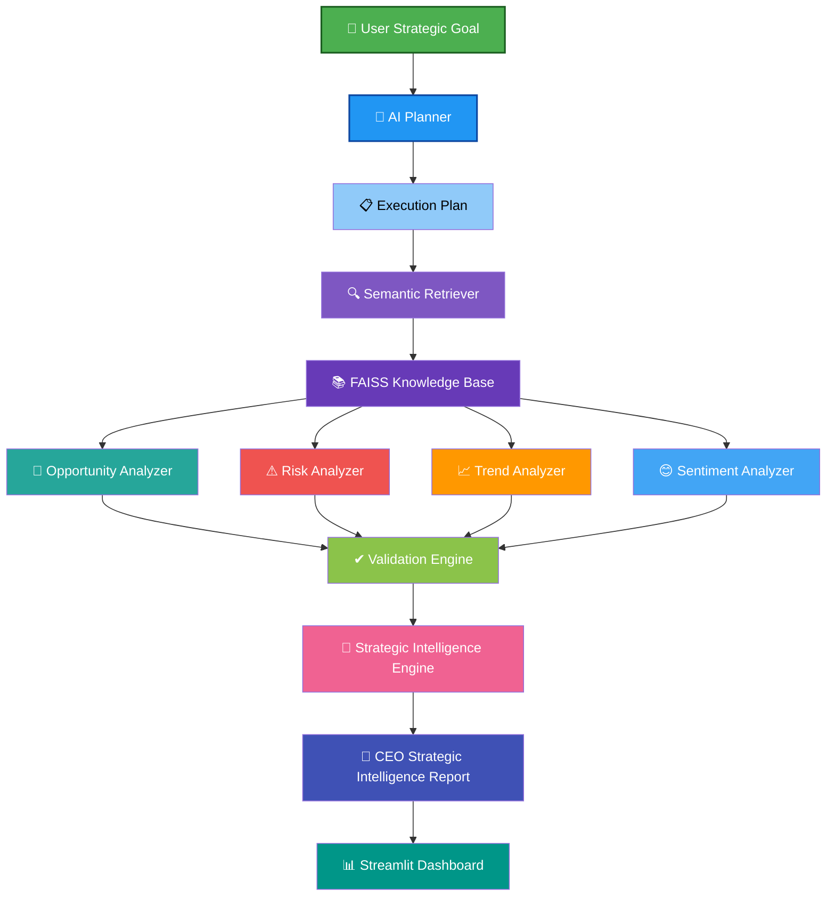
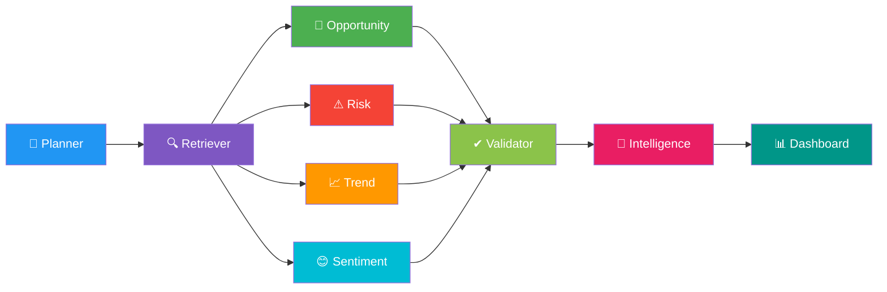
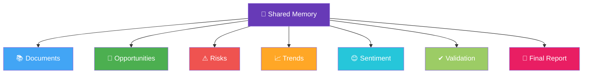
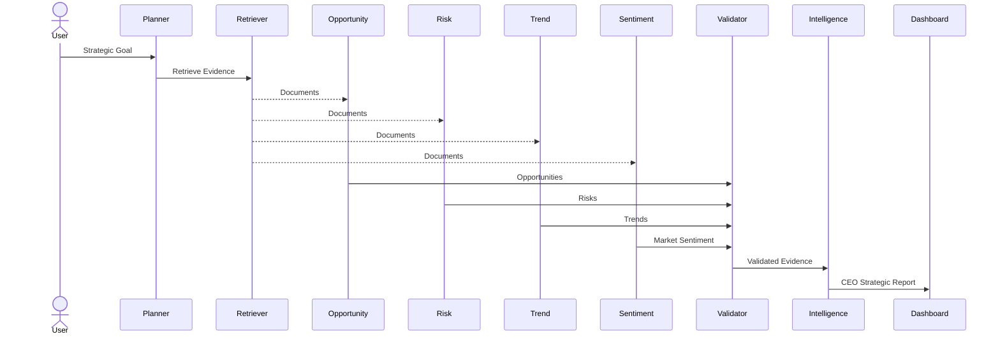

<div align="center">

# 🤖 AI CEO Strategic Intelligence Agent

### Autonomous Multi-Agent AI System for Executive Decision Intelligence

<p align="center">


</p>

---

### 🚀 Autonomous Multi-Agent AI System for Strategic Business Intelligence

Retrieve ➜ Analyze ➜ Validate ➜ Recommend ➜ Generate CEO Reports

</div>

---

# 📖 Overview

The **AI CEO Strategic Intelligence Agent** is an autonomous **Multi-Agent AI System** that assists executive leadership in making strategic decisions through evidence-driven business intelligence.

Instead of using a single LLM prompt, the system decomposes the task into multiple specialized AI agents that collaborate through a shared memory architecture.

The system performs:

- 🔍 Semantic Search
- 🚀 Opportunity Analysis
- ⚠ Strategic Risk Analysis
- 📈 Emerging Trend Detection
- 😊 Market Sentiment Analysis
- ✔ Evidence Validation
- 👔 Executive Strategic Intelligence Generation

---

# ✨ Features

| Feature | Description |
|---------|-------------|
| 🧠 AI Planner | Dynamically creates execution workflows |
| 🔍 Semantic Retrieval | Retrieves relevant business documents using FAISS |
| 🚀 Opportunity Analyzer | Identifies strategic opportunities |
| ⚠ Risk Analyzer | Detects business risks |
| 📈 Trend Analyzer | Detects emerging technologies & innovations |
| 😊 Sentiment Analyzer | Performs market sentiment analysis |
| ✔ Validation Engine | Ensures evidence-based outputs |
| 👔 Strategic Intelligence Engine | Generates CEO strategic reports |
| 📊 Streamlit Dashboard | Interactive executive dashboard |
| 🔄 Shared Agent Memory | Enables collaboration among AI agents |

---

# 🏗️ System Architecture



---

# 🤖 Multi-Agent Collaboration



---

# 🧠 Shared Agent Memory



---

# 🔄 End-to-End Workflow



---

# 📂 Project Structure

```text
AI-CEO-Agent/

│

├── agent/

│ ├── planner.py

│ ├── executor.py

│ ├── retriever.py

│ ├── opportunity.py

│ ├── risk.py

│ ├── trend.py

│ ├── sentiment.py

│ ├── validator.py

│ ├── strategic_intelligence.py

│ ├── llm_helper.py

│ └── tools.py

│

├── dashboard/

│ └── app.py

│

├── data/

├── embeddings/

├── rag/

├── scripts/

│

├── main.py

└── README.md
```
