<div align="center">

# 🤖 AI CEO Strategic Intelligence Agent

### Autonomous Multi-Agent AI System for Executive Strategic Decision Intelligence

<p align="center">


</p>

---

### 🧠 Planner • Executor • Semantic Search • Multi-Agent AI • Strategic Intelligence • RAG • Executive Decision Support

Transform business news into **CEO-ready strategic intelligence reports** using **Autonomous AI Agents**, **Semantic Retrieval**, **Retrieval-Augmented Generation (RAG)** and **Local Large Language Models**.

</div>

---

# 📖 Project Overview

The **AI CEO Strategic Intelligence Agent** is an autonomous **Multi-Agent Artificial Intelligence System** that assists executive leadership in making evidence-based strategic decisions from large collections of business news.

Instead of asking a single Large Language Model to solve everything, the system divides the task into multiple specialized AI agents that collaborate through a **shared memory architecture**.

Each AI agent performs one specific responsibility:

- 🔍 Retrieve relevant information
- 🚀 Identify strategic opportunities
- ⚠ Analyze business risks
- 📈 Detect emerging trends
- 😊 Assess market sentiment
- ✔ Validate all findings
- 👔 Generate an executive strategic intelligence report

The final output is presented through an interactive **Streamlit Dashboard** designed for executive decision support.

---

# ✨ Key Features

| Category | Capability |
|-----------|------------|
| 🧠 Autonomous Planner | Dynamically creates an execution plan based on the user's strategic goal |
| ⚙ AI Executor | Executes every tool in sequence using shared memory |
| 🔍 Semantic Search | Retrieves relevant documents using FAISS vector similarity |
| 🚀 Opportunity Analysis | Identifies strategic business opportunities |
| ⚠ Risk Analysis | Detects operational and strategic risks |
| 📈 Trend Detection | Discovers emerging technologies and market trends |
| 😊 Sentiment Analysis | Evaluates article-level market sentiment |
| ✔ Validation Engine | Ensures all AI findings are evidence-based |
| 👔 Strategic Intelligence Engine | Produces CEO-ready intelligence reports |
| 📊 Executive Dashboard | Interactive visualization using Streamlit |

---

# 🎯 End-to-End AI Workflow

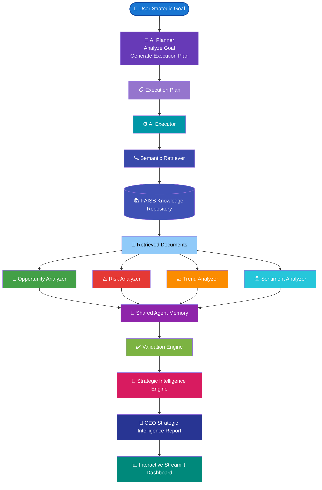

---

# 💡 Why a Multi-Agent Architecture?

Traditional Retrieval-Augmented Generation (RAG) systems retrieve documents and ask a single Large Language Model to generate an answer.

This project instead adopts a **Multi-Agent AI Architecture**, where independent AI agents collaborate to solve different aspects of a strategic intelligence problem.

### Benefits

- 🧠 Specialized reasoning by dedicated AI agents
- 🔄 Shared memory for inter-agent collaboration
- ✔ Evidence validation before reporting
- 📊 Explainable and transparent decision making
- 📈 Modular and extensible architecture
- 👔 Executive-focused intelligence generation

The result is a scalable and explainable AI system capable of producing high-quality strategic recommendations for executive decision makers.

---
# 🏗️ System Architecture

The AI CEO Strategic Intelligence Agent follows a **modular Multi-Agent Architecture**, where each component performs a specialized task while collaborating through a shared memory system.

The architecture is divided into five logical layers:

| Layer | Responsibility |
|--------|----------------|
| 👤 User Layer | Accepts strategic business goals from executives |
| 🧠 Planning Layer | Generates an intelligent execution plan using the Planner Agent |
| ⚙️ Execution Layer | Executes specialized AI agents sequentially |
| 🧠 Intelligence Layer | Validates insights and generates executive intelligence |
| 📊 Presentation Layer | Displays CEO-ready reports through the Streamlit dashboard |

---

## High-Level System Architecture

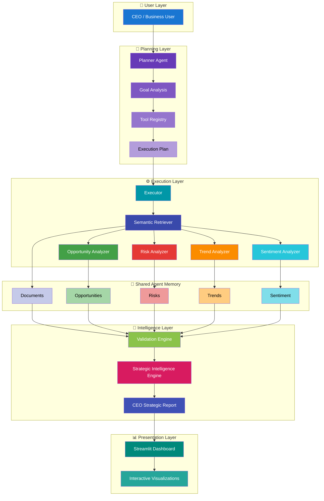

---

# 🧩 System Components

## 👤 User Layer

The interaction begins when an executive enters a strategic business objective through the Streamlit dashboard.

Example:

```text
Analyze NVIDIA's strategic opportunities in the AI chip market.
```

---

## 🧠 Planning Layer

The Planner Agent transforms the user's objective into a structured execution workflow.

Responsibilities:

- Analyze user intent
- Load the Tool Registry
- Select appropriate AI agents
- Generate an execution plan
- Validate workflow integrity

---

## ⚙️ Execution Layer

The Executor Agent dynamically loads and executes each AI tool.

Responsibilities:

- Import tool modules
- Execute agents sequentially
- Maintain shared memory
- Store intermediate results
- Handle execution failures

---

## 🧠 Shared Agent Memory

Instead of each AI agent working independently, all agents communicate through a centralized memory object.

Stored information includes:

- Retrieved Documents
- Strategic Opportunities
- Business Risks
- Emerging Trends
- Market Sentiment
- Validation Results
- Executive Report

This architecture enables seamless collaboration between autonomous AI agents.

---

## 👔 Intelligence Layer

The Validation Engine verifies that every generated insight is supported by retrieved evidence.

After validation, the Strategic Intelligence Engine synthesizes all validated findings into a comprehensive CEO report containing:

- Executive Summary
- Strategic Opportunities
- Strategic Risks
- Emerging Trends
- Market Sentiment
- Strategic Recommendations
- CEO Briefing

---

## 📊 Presentation Layer

The Streamlit Dashboard presents all AI-generated intelligence in an executive-friendly format.

The dashboard includes:

- Interactive KPI Cards
- Opportunity Analysis
- Risk Analysis
- Trend Analysis
- Market Sentiment
- Strategic Recommendations
- CEO Briefing
- Executive Intelligence Report

---
# 🤖 Multi-Agent Architecture

Unlike traditional Retrieval-Augmented Generation (RAG) systems that rely on a single Large Language Model, this project adopts a **Multi-Agent AI Architecture**.

Each AI agent is responsible for a specialized task while collaborating through a centralized **Shared Agent Memory**.

This modular design improves:

- 🎯 Specialization
- 🔄 Collaboration
- 📚 Explainability
- ⚡ Scalability
- ✔ Evidence-based reasoning

---

# 🧠 Multi-Agent Collaboration

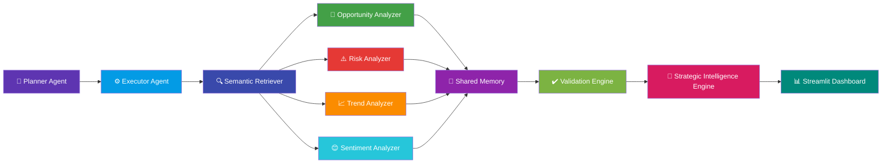

---

# 🧠 Shared Agent Memory

The system uses a centralized **Shared Agent Memory** that enables communication between independent AI agents.

Instead of passing data directly between tools, each agent stores its output inside a common memory object.

Every subsequent agent reads only the information it requires.

---

## Memory Structure

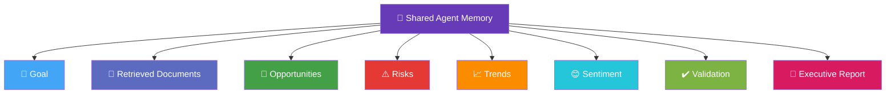

---

# 🔄 Agent Execution Sequence

Every AI agent contributes one specialized capability before handing control to the next stage.

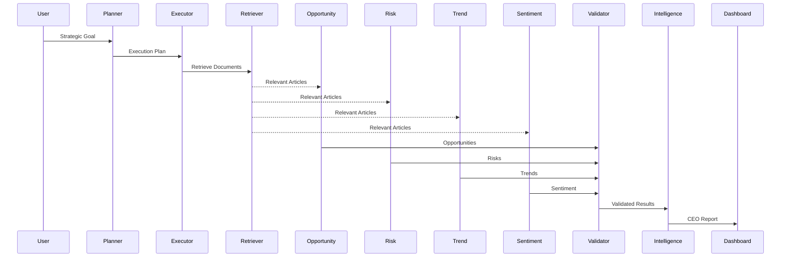

---

# ⚙️ AI Agents

| AI Agent | Responsibility | Output |
|-----------|---------------|--------|
| 🧠 Planner Agent | Analyzes the user's goal and creates an execution plan | Execution Plan |
| ⚙️ Executor Agent | Dynamically executes each AI tool | Updated Shared Memory |
| 🔍 Semantic Retriever | Retrieves relevant documents using FAISS | Relevant Articles |
| 🚀 Opportunity Analyzer | Detects strategic business opportunities | Opportunities |
| ⚠️ Risk Analyzer | Identifies strategic and operational risks | Risks |
| 📈 Trend Analyzer | Detects emerging technologies and market trends | Trends |
| 😊 Sentiment Analyzer | Classifies article-level market sentiment | Sentiment |
| ✔️ Validation Engine | Verifies every insight using supporting evidence | Validated Intelligence |
| 👔 Strategic Intelligence Engine | Generates executive strategic intelligence | CEO Report |

---

# 🎯 Why Multiple AI Agents?

Instead of assigning one Large Language Model every task, the workload is divided among specialized AI agents.

This approach offers several advantages:

| Traditional Single-Agent AI | Multi-Agent AI System |
|-----------------------------|-----------------------|
| One prompt performs every task | Specialized agents perform dedicated tasks |
| Difficult to validate outputs | Validation engine verifies every insight |
| Limited explainability | Each agent has a transparent responsibility |
| Hard to extend | New agents can be added easily |
| Monolithic architecture | Modular and scalable design |
| Single reasoning pathway | Collaborative reasoning across agents |

---

# ⭐ Key Architectural Advantages

✅ Modular AI architecture

✅ Dynamic planning and execution

✅ Shared memory communication

✅ Explainable reasoning

✅ Evidence-based validation

✅ Easy extensibility

✅ Retrieval-Augmented Generation (RAG)

✅ Executive-focused intelligence generation

---
# 🧠 AI Planning & Execution Engine

One of the distinguishing features of this project is its **Autonomous Planning and Execution Framework**.

Instead of hardcoding the workflow, the system dynamically determines **which AI agents to execute** based on the user's strategic goal.

The framework consists of two autonomous components:

- 🧠 **Planner Agent**
- ⚙️ **Executor Agent**

Together they orchestrate the complete strategic intelligence pipeline.

---

# 🧠 Planner Architecture

The Planner Agent transforms a natural language business objective into a structured execution workflow.

Responsibilities include:

- Understanding the user's intent
- Loading the Tool Registry
- Selecting appropriate AI agents
- Generating an execution plan using Qwen
- Validating the generated workflow
- Passing the validated plan to the Executor

---

## Planner Workflow

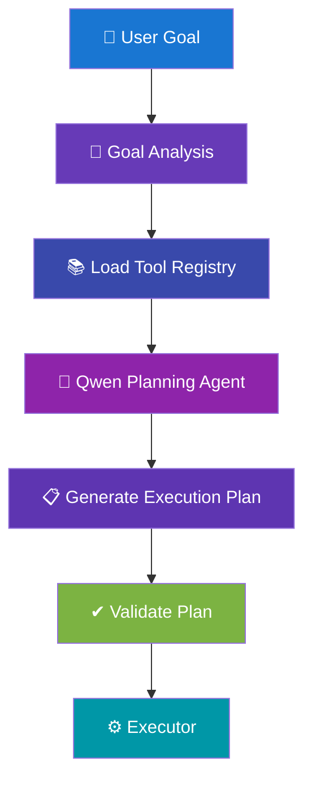

---

# 📋 Execution Plan Example

For the strategic goal:

```text
Analyze NVIDIA's strategic position in the AI market.
```

The Planner automatically generates:

```text
1. SemanticRetriever

2. OpportunityAnalyzer

3. RiskAnalyzer

4. TrendAnalyzer

5. SentimentAnalyzer

6. Validator

7. StrategicIntelligenceEngine
```

Each step includes:

- Tool Name
- Purpose
- Reason
- Expected Output

before execution begins.

---

# 🛠 Tool Registry

The Tool Registry acts as the knowledge base of available AI agents.

Each tool contains:

| Property | Description |
|----------|-------------|
| Name | Tool Identifier |
| Description | Purpose of the tool |
| Module | Python module location |
| Function | Function executed |
| Input | Expected input |
| Output | Produced output |

---

## Tool Registry Architecture

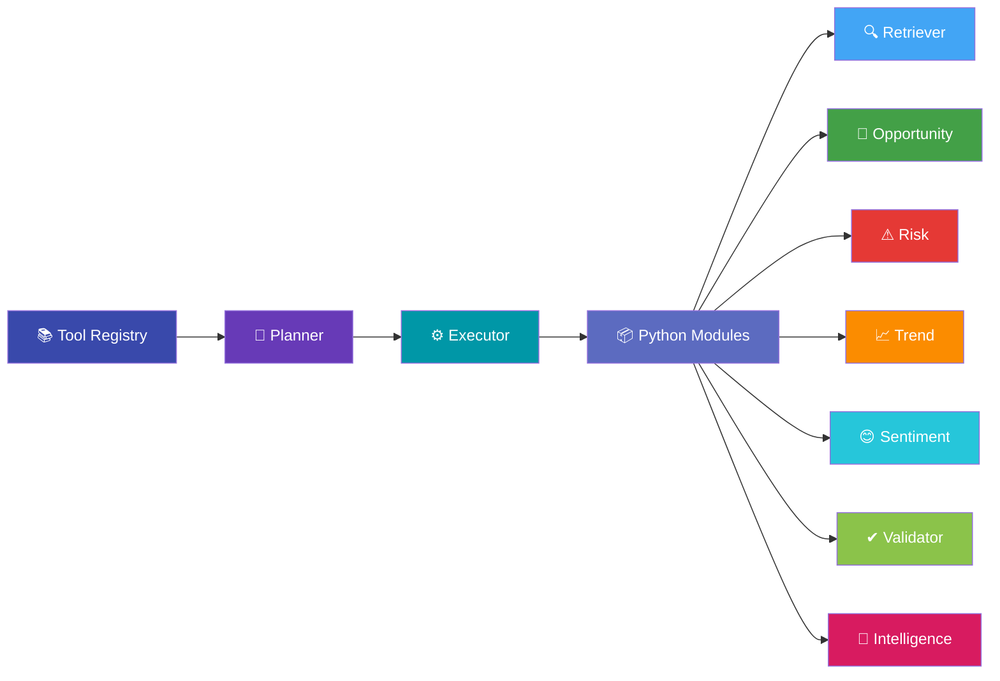

---

# ⚙️ Executor Architecture

The Executor Agent is responsible for carrying out the execution plan generated by the Planner.

Unlike traditional workflows with hardcoded function calls, the Executor dynamically imports and executes Python modules at runtime.

Responsibilities:

- Read execution plan
- Dynamically import modules
- Execute tools sequentially
- Update shared memory
- Handle execution errors
- Produce the final intelligence report

---

## Executor Workflow

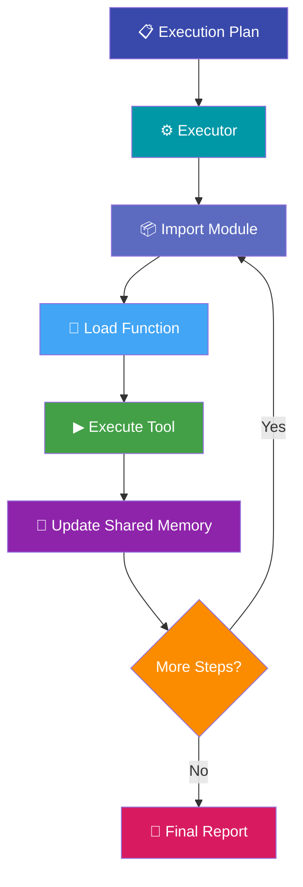

---

# 🔄 Dynamic Module Loading

One of the key engineering features of the system is **dynamic module execution**.

Rather than hardcoding individual AI agents, the Executor imports each module during runtime based on the execution plan.

This enables:

- Modular development
- Easy addition of new AI agents
- Low coupling between components
- Flexible execution workflows

---

# 📊 Planning vs Execution

| Planner | Executor |
|----------|----------|
| Understands user goals | Executes AI tools |
| Generates execution plan | Follows execution plan |
| Chooses required agents | Loads Python modules |
| Validates workflow | Updates shared memory |
| Uses Qwen for reasoning | Uses Python for orchestration |

---

# 🚀 Engineering Advantages

✅ Dynamic execution planning

✅ Runtime module loading

✅ Decoupled software architecture

✅ Easily extensible tool registry

✅ Modular AI components

✅ Reusable execution engine

✅ Maintainable codebase

✅ Scalable multi-agent framework

---
# 🔍 Knowledge Base & Semantic Retrieval

The AI CEO Strategic Intelligence Agent leverages **Retrieval-Augmented Generation (RAG)** to provide evidence-based strategic intelligence.

Instead of relying solely on the Large Language Model's internal knowledge, the system retrieves relevant business documents from a semantic vector database before any analysis begins.

This ensures that all AI-generated insights are grounded in real business news and supporting evidence.

---

# 🧠 Retrieval-Augmented Generation (RAG) Pipeline

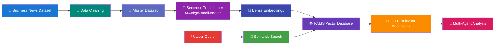

---

# 📚 Knowledge Base Construction

The knowledge base is constructed through a multi-stage preprocessing pipeline.

## Stage 1 — Data Collection

Business news articles are collected and consolidated into a master dataset.

Each document contains:

- Title
- Source
- Publication Date
- Article Content

---

## Stage 2 — Data Processing

Each article is cleaned and standardized before embedding generation.

Typical preprocessing includes:

- Removing missing values
- Text normalization
- Metadata extraction
- Dataset consolidation

---

## Stage 3 — Embedding Generation

Every document is transformed into a dense semantic vector using:

| Component | Technology |
|-----------|------------|
| Embedding Model | BAAI/bge-small-en-v1.5 |
| Library | SentenceTransformers |
| Output | Dense Vector Representation |

These embeddings capture the semantic meaning of each document rather than relying on keyword matching.

---

## Stage 4 — Vector Indexing

The generated embeddings are stored inside a **FAISS Vector Database**.

Advantages of FAISS include:

- High-speed similarity search
- Efficient nearest-neighbor retrieval
- Scalable indexing
- Low-latency document lookup

---

# 🔍 Semantic Search Workflow

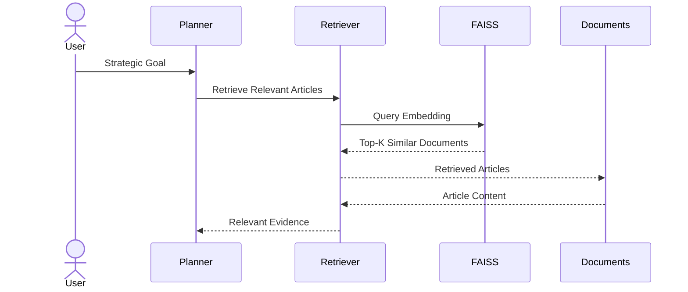

---

# 🧠 Why Semantic Search?

Traditional keyword search retrieves documents based only on matching words.

Semantic search retrieves documents based on **meaning**, enabling the system to discover relevant information even when different terminology is used.

Example:

| User Query | Retrieved Result |
|------------|------------------|
| AI chip competition | NVIDIA Blackwell architecture |
| GPU demand | Data center infrastructure expansion |
| Semiconductor market | Advanced packaging technologies |

---

# 📊 FAISS Retrieval Pipeline

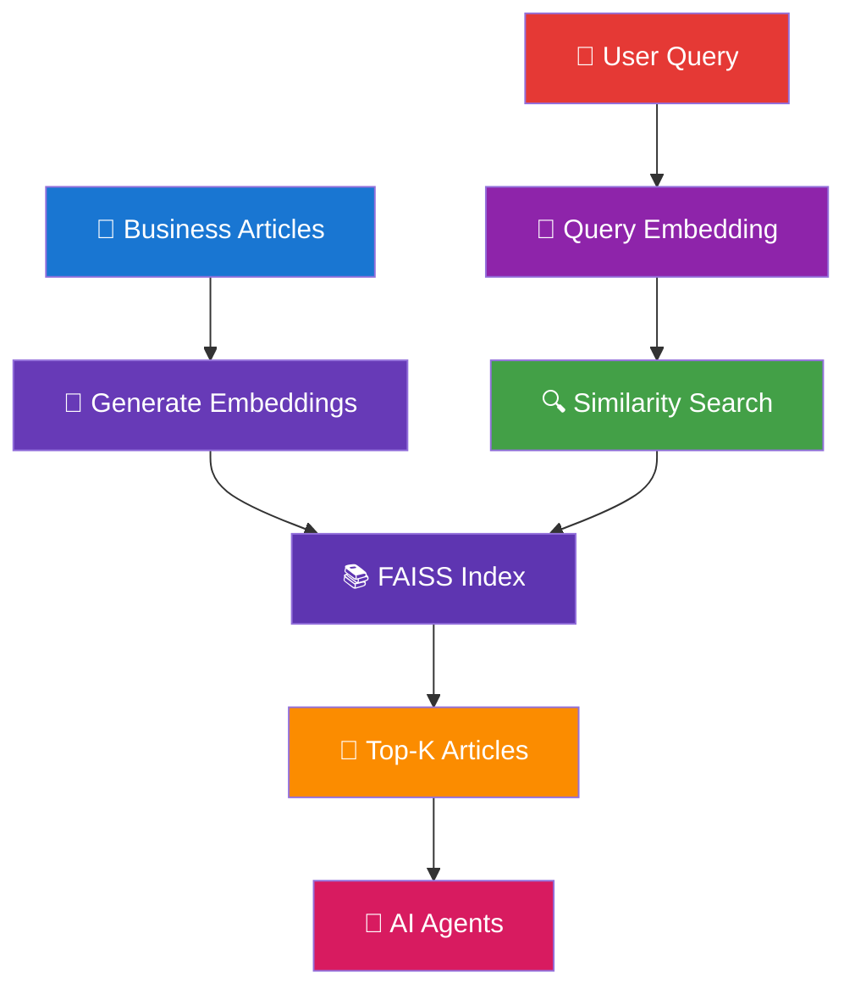

---

# 📈 Retrieval Process

The retrieval process follows four key stages:

| Step | Description |
|------|-------------|
| **1. Encode Query** | Convert the user's strategic goal into a semantic embedding |
| **2. Search FAISS** | Perform nearest-neighbor similarity search |
| **3. Retrieve Top-K** | Return the most relevant business articles |
| **4. Pass to AI Agents** | Supply retrieved evidence to all specialized agents |

---

# 🚀 Benefits of the Retrieval Layer

- 🔍 Semantic understanding instead of keyword matching
- 📚 Evidence-grounded AI reasoning
- ⚡ Fast similarity search using FAISS
- 🧠 Improved response relevance
- ✔ Reduced hallucination risk
- 📈 Scalable document retrieval
- 🤖 Supports autonomous multi-agent analysis

---

# 💡 Why Retrieval Matters

Without semantic retrieval, the Large Language Model would rely primarily on its pre-trained knowledge.

By integrating a vector database, the system grounds every strategic recommendation in **real business articles**, enabling:

- Explainable AI outputs
- Evidence-based strategic insights
- Higher reliability
- Improved executive trust

This Retrieval-Augmented Generation (RAG) pipeline forms the foundation of the entire strategic intelligence system.

---
# 🧠 AI Analysis & Intelligence Engine

After retrieving relevant business documents, the AI CEO Strategic Intelligence Agent performs a multi-stage analysis using specialized AI agents.

Each agent focuses on a single strategic objective while collaborating through the **Shared Agent Memory**.

This modular approach enables explainable, evidence-based strategic reasoning.

---

# 🤖 Intelligence Generation Pipeline

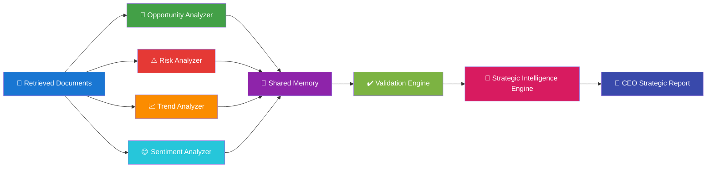

---

# 🚀 Opportunity Analyzer

The Opportunity Analyzer identifies strategic business opportunities supported by retrieved evidence.

Its objective is to discover areas where the organization can create value, expand capabilities, or strengthen its competitive advantage.

### Responsibilities

- Detect growth opportunities
- Identify investment potential
- Discover innovation opportunities
- Extract supporting evidence
- Assign business impact

### Output

```json
{
  "opportunity": "...",
  "evidence": "...",
  "impact": "High"
}
```

---

# ⚠️ Risk Analyzer

The Risk Analyzer evaluates business documents to identify operational and strategic risks.

Only evidence-backed risks are retained.

### Responsibilities

- Identify strategic risks
- Detect operational challenges
- Highlight market uncertainty
- Evaluate potential impact

### Output

```json
{
  "risk": "...",
  "evidence": "...",
  "impact": "Medium"
}
```

---

# 📈 Trend Analyzer

The Trend Analyzer discovers emerging technologies, market movements, and innovation signals.

### Responsibilities

- Technology trends
- Market trends
- Innovation signals
- Industry developments

### Output

```json
{
  "trend": "...",
  "evidence": "...",
  "impact": "High"
}
```

---

# 😊 Sentiment Analyzer

The Sentiment Analyzer evaluates each retrieved article independently to determine overall market sentiment.

Each article is classified into one of three categories.

| Sentiment | Meaning |
|-----------|---------|
| 🟢 Positive | Optimistic business outlook |
| 🟡 Neutral | Balanced reporting |
| 🔴 Negative | Concern or uncertainty |

### Output

```json
{
  "title":"...",
  "sentiment":"Positive",
  "reason":"..."
}
```

---

# 🧠 Shared Memory Collaboration

Every AI agent writes its findings into a centralized Shared Agent Memory.

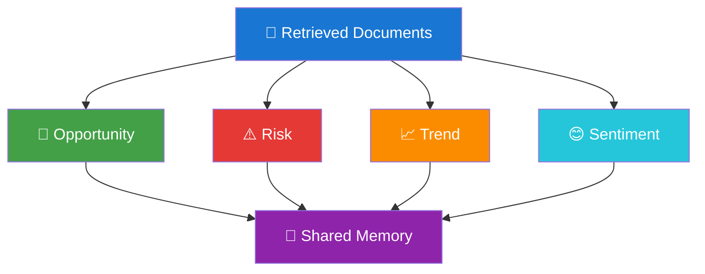

The Shared Memory stores:

- Retrieved Documents
- Opportunities
- Risks
- Trends
- Sentiment
- Validation Results
- Final Executive Report

This enables independent AI agents to collaborate without direct dependencies.

---

# ✔️ Validation Engine

Before generating the final report, every AI-generated insight is validated.

The Validation Engine ensures:

- Required fields are present
- Supporting evidence exists
- Impact levels are valid
- Duplicate findings are removed
- Sentiment labels are valid

Only validated information is passed to the Strategic Intelligence Engine.

---

## Validation Workflow


---

# 👔 Strategic Intelligence Engine

After validation, all verified intelligence is synthesized into a comprehensive executive report.

The Strategic Intelligence Engine combines:

- Strategic Opportunities
- Strategic Risks
- Emerging Trends
- Market Sentiment

into a structured **CEO Strategic Intelligence Report**.

---

# 📑 CEO Strategic Intelligence Report

The generated report includes:

| Section | Description |
|---------|-------------|
| 📌 Executive Summary | High-level overview of strategic findings |
| 🚀 Strategic Opportunities | Business growth opportunities |
| ⚠️ Strategic Risks | Evidence-backed risks |
| 📈 Emerging Trends | Technology and market trends |
| 😊 Sentiment Analysis | News, public sentiment, and sentiment trends |
| 🎯 Strategic Recommendations | Prioritized executive recommendations |
| 👔 CEO Briefing | What happened, why it matters, and next actions |

---

# 🎯 End Result

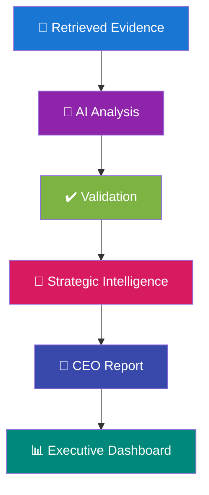

---

# ⭐ Key Advantages

- 🎯 Specialized AI agents for focused reasoning
- 📚 Evidence-based strategic analysis
- ✔️ Automated validation of AI outputs
- 🧠 Shared memory collaboration
- 📊 Executive-ready intelligence generation
- 🔄 Modular and extensible architecture
- 🚀 Transparent decision-support pipeline

The result is a robust strategic intelligence system capable of transforming raw business news into validated, actionable insights for executive decision-making.

---
# 📊 Executive Intelligence Dashboard

The AI CEO Strategic Intelligence Agent provides an interactive **Streamlit Dashboard** that enables executives to explore AI-generated business intelligence through intuitive visualizations and structured reports.

The dashboard transforms complex strategic analysis into actionable insights that support executive decision-making.

---

# 🎯 Dashboard Overview

The dashboard guides users through the complete strategic intelligence workflow—from entering a business objective to reviewing the final CEO report.


---

# 🖥 Dashboard Sections

| Section | Description |
|----------|-------------|
| 🎯 Strategic Goal | Accepts executive business objectives |
| 🧠 Execution Plan | Displays the AI-generated workflow |
| 📄 Retrieved Articles | Shows evidence retrieved from the FAISS knowledge base |
| 🚀 Opportunity Analysis | Displays strategic opportunities |
| ⚠ Risk Analysis | Highlights strategic and operational risks |
| 📈 Trend Analysis | Shows emerging market and technology trends |
| 😊 Sentiment Analysis | Visualizes market sentiment |
| ✔ Validation Summary | Displays validated AI outputs |
| 👔 CEO Strategic Report | Final executive intelligence report |

---

# 📌 Dashboard Workflow

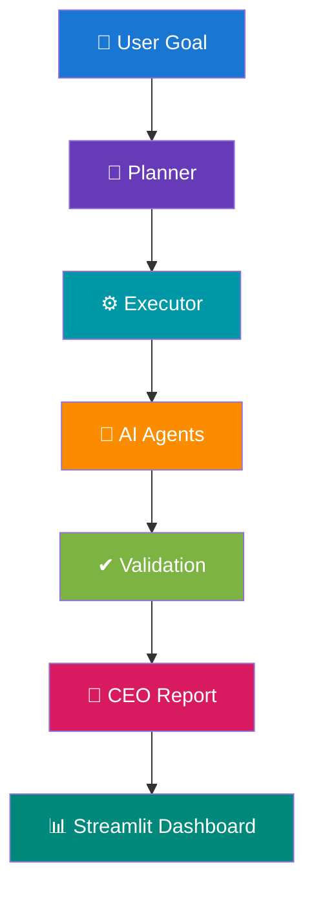

---

# 📈 Dashboard Analytics

The dashboard summarizes the analysis using key performance indicators (KPIs).

### Executive KPI Cards

- 🚀 Total Opportunities
- ⚠ Total Risks
- 📈 Emerging Trends
- 😊 Market Sentiment Distribution
- 📄 Retrieved Articles
- ✔ Validation Status

---

# 📊 Interactive Visualizations

The dashboard includes multiple interactive visualizations to support executive decision-making.

| Visualization | Purpose |
|--------------|---------|
| 📊 Bar Chart | Opportunity, Risk, and Trend counts |
| 🥧 Pie Chart | Sentiment distribution |
| 📈 Trend Graph | Emerging technology trends |
| 📋 KPI Cards | High-level executive metrics |
| 📄 Expandable Reports | Detailed AI-generated findings |

---

# 🚀 Strategic Opportunities

Each identified opportunity includes:

- Opportunity Description
- Supporting Evidence
- Business Impact

Example:

```text
Opportunity

Expand AI infrastructure partnerships

Evidence

Microsoft expands investment in AI data centers.

Impact

High
```

---

# ⚠ Strategic Risks

Each identified risk includes:

- Risk Description
- Supporting Evidence
- Risk Impact

Example:

```text
Risk

Supply chain dependence on advanced packaging

Evidence

Increasing demand for semiconductor manufacturing capacity.

Impact

High
```

---

# 📈 Emerging Trends

Trend Analysis identifies major technology and business developments.

Examples include:

- AI Infrastructure Growth
- Generative AI Adoption
- Semiconductor Innovation
- Data Center Expansion
- Cloud Computing Investment

---

# 😊 Market Sentiment

The dashboard summarizes article-level sentiment.

Sentiment Categories:

🟢 Positive

🟡 Neutral

🔴 Negative

Each sentiment includes:

- Article Title
- Sentiment Classification
- Evidence-Based Reason

---

# 👔 CEO Strategic Intelligence Report

The dashboard concludes with an executive-level report generated by the Strategic Intelligence Engine.

The report contains:

- 📌 Executive Summary
- 🚀 Strategic Opportunities
- ⚠ Strategic Risks
- 📈 Emerging Trends
- 😊 Market Sentiment
- 🎯 Strategic Recommendations
- 👔 CEO Briefing

This enables executives to quickly understand:

- What happened?
- Why does it matter?
- What should management do next?

---

# 🎯 Executive Decision Support


---

# ⭐ Dashboard Highlights

✅ Interactive executive dashboard

✅ Real-time AI workflow visualization

✅ Evidence-backed strategic insights

✅ Executive KPI metrics

✅ Explainable AI recommendations

✅ Professional CEO briefing

The dashboard serves as the final interface between the Multi-Agent AI System and executive decision-makers, transforming complex analytical outputs into actionable business intelligence.

# ⚙️ Installation & Usage

## 📋 Prerequisites

Before running the project, ensure the following software is installed.

| Software | Version |
|-----------|----------|
| Python | 3.11+ |
| Ollama | Latest |
| Git | Latest |
| Streamlit | Latest |

---

# 📦 Clone Repository

```bash
git clone https://github.com/<your-username>/AI-CEO-Strategic-Intelligence-Agent.git

cd AI-CEO-Strategic-Intelligence-Agent
```

---

# 🐍 Create Virtual Environment

### Windows

```bash
python -m venv venv

venv\Scripts\activate
```

### Linux / macOS

```bash
python3 -m venv venv

source venv/bin/activate
```

---

# 📥 Install Dependencies

```bash
pip install -r requirements.txt
```

---

# 🤖 Install Ollama

Download Ollama from:

https://ollama.com/download

---

# 📥 Pull the Qwen Model

```bash
ollama pull qwen2.5:3b
```

Verify installation

```bash
ollama run qwen2.5:3b
```

---

# 📚 Build the Knowledge Base

Generate document embeddings

```bash
python scripts/generate_embeddings.py
```

Build the FAISS index

```bash
python scripts/build_faiss_index.py
```

---

# 🚀 Launch the Dashboard

```bash
streamlit run dashboard/app.py
```

Open

```
http://localhost:8501
```

---

# 🧪 Example Usage

Example Goal

```
Analyze NVIDIA's strategic opportunities in the AI chip market.
```

The AI system automatically performs:

```
Semantic Retrieval

↓

Opportunity Analysis

↓

Risk Analysis

↓

Trend Detection

↓

Sentiment Analysis

↓

Validation

↓

Strategic Intelligence Report
```

---

# 📂 Project Structure

```text
AI-CEO-Strategic-Intelligence-Agent
│
├── agent
│   ├── executor.py
│   ├── planner.py
│   ├── retriever.py
│   ├── opportunity.py
│   ├── risk.py
│   ├── trend.py
│   ├── sentiment.py
│   ├── validator.py
│   ├── strategic_intelligence.py
│   ├── llm_helper.py
│   └── tools.py
│
├── dashboard
│   └── app.py
│
├── data
│   ├── processed
│   │     ├── master_dataset.csv
│   │     ├── embeddings.npy
│   │     └── faiss_index.bin
│   │
│   └── raw
│
├── scripts
│   ├── generate_embeddings.py
│   └── build_faiss_index.py
│
├── requirements.txt
│
├── main.py
│
└── README.md
```

---

# 💻 Technology Stack

| Category | Technology |
|----------|------------|
| Programming Language | Python 3.11 |
| Large Language Model | Qwen 2.5 (Ollama) |
| Embedding Model | BAAI/bge-small-en-v1.5 |
| Vector Database | FAISS |
| Embedding Library | SentenceTransformers |
| Dashboard | Streamlit |
| Data Processing | Pandas, NumPy |
| Visualization | Plotly |
| AI Architecture | Multi-Agent AI |
| Retrieval | Retrieval-Augmented Generation (RAG) |

---

# 🔧 Core Components

| Component | Responsibility |
|-----------|----------------|
| Planner | Generates execution plan |
| Executor | Executes AI workflow |
| Semantic Retriever | Retrieves relevant articles |
| Opportunity Analyzer | Finds strategic opportunities |
| Risk Analyzer | Detects business risks |
| Trend Analyzer | Identifies emerging trends |
| Sentiment Analyzer | Evaluates market sentiment |
| Validator | Verifies AI-generated outputs |
| Strategic Intelligence Engine | Generates executive reports |

---

# 📊 Performance Characteristics

| Metric | Description |
|----------|------------|
| Retrieval Method | Semantic Similarity Search |
| Embedding Dimension | 384 |
| Vector Search Engine | FAISS IndexFlatL2 |
| Knowledge Source | Business News Articles |
| AI Reasoning | Local Qwen 2.5 via Ollama |
| Report Generation | Structured JSON Output |

---

# 🎯 Design Principles

The system was developed around the following software engineering principles.

### 🧠 Modularity

Each AI agent performs one well-defined responsibility.

---

### 🔄 Separation of Concerns

Planning, execution, retrieval, analysis, validation, and reporting are implemented as independent components.

---

### 📚 Evidence-Based Reasoning

Every recommendation generated by the AI must be supported by retrieved business evidence.

---

### ✔ Explainability

All strategic findings include supporting evidence, impact assessment, and validation.

---

### ⚡ Extensibility

New AI agents can be added simply by registering them in the Tool Registry without changing the Executor.

---

# 📈 Current Capabilities

✅ Semantic document retrieval

✅ Opportunity analysis

✅ Risk analysis

✅ Trend detection

✅ Sentiment analysis

✅ AI validation

✅ Executive report generation

✅ Interactive dashboard

✅ Multi-Agent architecture

---

# 🔮 Future Enhancements

The project can be extended with several advanced capabilities.

### 🤖 Advanced AI

- GPT-4 / Llama integration
- Multi-LLM routing
- Autonomous planning improvements

---

### 📈 Analytics

- Time-series trend forecasting
- Predictive business intelligence
- Competitive benchmarking

---

### 🌍 Data Sources

- Financial reports
- SEC filings
- Company earnings calls
- Real-time news APIs
- Social media analytics

---

### ☁ Deployment

- Docker support
- Kubernetes deployment
- REST API
- Cloud hosting
- Authentication

---

# 🏆 Learning Outcomes

This project demonstrates practical experience with:

- Multi-Agent AI Systems
- Retrieval-Augmented Generation (RAG)
- Vector Databases (FAISS)
- Local Large Language Models
- Semantic Search
- AI Planning & Execution
- Streamlit Dashboard Development
- Explainable AI
- Executive Decision Support Systems

---

# 📜 License

This project is released under the **MIT License**.

---

# 👨‍💻 Author

**Your Name**

Master of Information Technology

Specialization: Artificial Intelligence

GitHub: https://github.com/<your-username>

LinkedIn: https://linkedin.com/in/<your-profile>

---

<div align="center">

## ⭐ If you found this project interesting, consider giving it a star!

Built with ❤️ using Python, Ollama, FAISS, Streamlit, and Multi-Agent AI.

</div>
