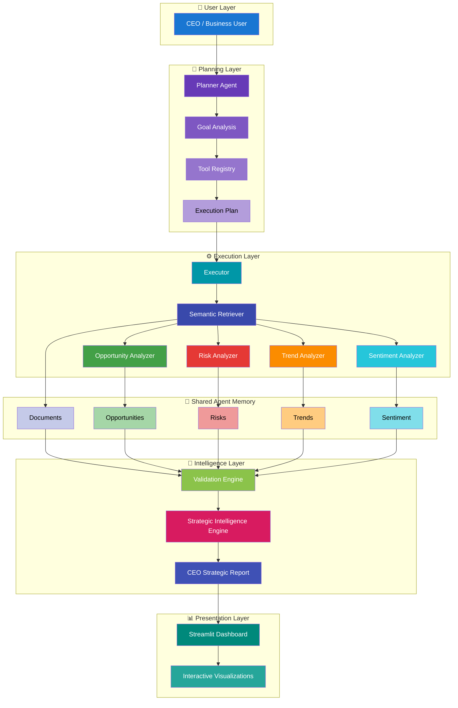
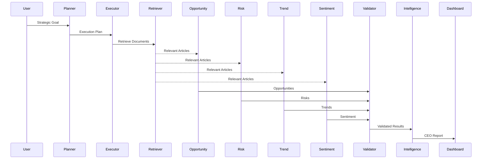
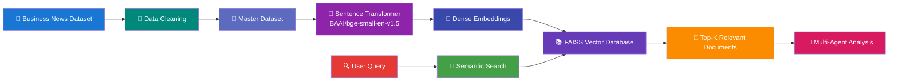

<div align="center">

# 🤖 AI CEO Strategic Intelligence Agent

### Autonomous Multi-Agent AI System for Executive Strategic Decision Intelligence

<p align="center">


</p>

Transform business news into **CEO-ready strategic intelligence reports** using autonomous AI agents, semantic retrieval, Retrieval-Augmented Generation (RAG), and a local Large Language Model.

</div>

---

## 📖 Overview

The **AI CEO Strategic Intelligence Agent** is an autonomous multi-agent AI system that helps executive leadership make evidence-based strategic decisions from large collections of business news.

Rather than asking a single LLM to do everything, the system splits the work across specialized agents that collaborate through a **shared memory** object. Each agent has one job:

- 🔍 Retrieve relevant information
- 🚀 Identify strategic opportunities
- ⚠️ Analyze business risks
- 📈 Detect emerging trends
- 😊 Assess market sentiment
- ✔️ Validate all findings
- 👔 Generate an executive strategic intelligence report

Results are presented through an interactive **Streamlit dashboard** built for executive decision support.

---

## ✨ Key Features

| Category | Capability |
|-----------|------------|
| 🧠 Autonomous Planner | Dynamically builds an execution plan from the user's strategic goal |
| ⚙️ AI Executor | Runs each tool in sequence, updating shared memory |
| 🔍 Semantic Search | Retrieves relevant documents via FAISS vector similarity |
| 🚀 Opportunity Analysis | Surfaces strategic business opportunities |
| ⚠️ Risk Analysis | Detects operational and strategic risks |
| 📈 Trend Detection | Identifies emerging technologies and market trends |
| 😊 Sentiment Analysis | Scores article-level market sentiment |
| ✔️ Validation Engine | Confirms every finding is evidence-based |
| 👔 Strategic Intelligence Engine | Synthesizes a CEO-ready report |
| 📊 Executive Dashboard | Interactive visualization in Streamlit |

---

## 🎯 End-to-End Workflow


---

## 💡 Why Multi-Agent Instead of a Single LLM?

Traditional RAG systems retrieve documents and hand them to one LLM to generate an answer. This project instead uses independent, specialized agents that collaborate through shared memory:

- 🧠 Specialized reasoning per agent
- 🔄 Shared memory for inter-agent collaboration
- ✔️ Evidence validation before reporting
- 📊 Explainable, transparent decision-making
- 📈 Modular, extensible architecture

| Traditional Single-Agent AI | Multi-Agent AI System |
|-----------------------------|-----------------------|
| One prompt performs every task | Specialized agents perform dedicated tasks |
| Difficult to validate outputs | Validation engine verifies every insight |
| Limited explainability | Each agent has a transparent responsibility |
| Hard to extend | New agents added easily via Tool Registry |
| Monolithic architecture | Modular, scalable design |

---

## 🏗️ System Architecture

The system is organized into five layers:

| Layer | Responsibility |
|--------|----------------|
| 👤 User Layer | Accepts strategic goals from executives |
| 🧠 Planning Layer | Planner Agent builds an execution plan |
| ⚙️ Execution Layer | Executor runs specialized agents sequentially |
| 🧠 Intelligence Layer | Validates insights, generates executive report |
| 📊 Presentation Layer | Streamlit dashboard displays the CEO-ready report |



---

## 🤖 AI Agents

| Agent | Responsibility | Output |
|-----------|---------------|--------|
| 🧠 Planner Agent | Analyzes the user's goal, creates an execution plan | Execution Plan |
| ⚙️ Executor Agent | Dynamically executes each AI tool | Updated Shared Memory |
| 🔍 Semantic Retriever | Retrieves relevant documents using FAISS | Relevant Articles |
| 🚀 Opportunity Analyzer | Detects strategic business opportunities | Opportunities |
| ⚠️ Risk Analyzer | Identifies strategic/operational risks | Risks |
| 📈 Trend Analyzer | Detects emerging technologies and market trends | Trends |
| 😊 Sentiment Analyzer | Classifies article-level market sentiment | Sentiment |
| ✔️ Validation Engine | Verifies every insight using supporting evidence | Validated Intelligence |
| 👔 Strategic Intelligence Engine | Generates executive strategic intelligence | CEO Report |

### Agent Execution Sequence



### Planner & Executor

The **Planner** turns a natural-language goal (e.g. *"Analyze NVIDIA's strategic opportunities in the AI chip market"*) into a structured plan by analyzing intent, consulting the Tool Registry, and using Qwen to select and order the needed agents. Example generated plan:

```text
1. SemanticRetriever
2. OpportunityAnalyzer
3. RiskAnalyzer
4. TrendAnalyzer
5. SentimentAnalyzer
6. Validator
7. StrategicIntelligenceEngine
```

The **Executor** then dynamically imports and runs each module in order, updating shared memory after every step, until the final report is produced. Because modules are loaded at runtime from the Tool Registry rather than hardcoded, new agents can be added without touching the Executor.

### Shared Agent Memory

All agents read and write to one shared memory object instead of passing data directly between tools — this is what allows independent agents to collaborate. Stored fields: `goal`, `documents`, `opportunities`, `risks`, `trends`, `sentiment`, `validation`, `report`.

### Validation Engine

Before the final report is generated, every finding is checked for required fields, supporting evidence, valid impact levels, and duplicates — only validated findings reach the report.

---

## 🔍 Knowledge Base & Retrieval (RAG)

All AI-generated insights are grounded in real business news retrieved from a semantic vector database, rather than relying only on the LLM's internal knowledge.



**Pipeline stages:** collect & clean articles → generate dense embeddings with `BAAI/bge-small-en-v1.5` (via SentenceTransformers) → index them in FAISS for fast nearest-neighbor search → encode the user's query → retrieve the top-K most similar articles → pass them to the AI agents.

Semantic search retrieves by **meaning**, not just keywords:

| User Query | Retrieved Result |
|------------|------------------|
| AI chip competition | NVIDIA Blackwell architecture |
| GPU demand | Data center infrastructure expansion |
| Semiconductor market | Advanced packaging technologies |

This grounding reduces hallucination, improves relevance, and makes every recommendation explainable and evidence-backed.

---

## 📊 Executive Dashboard

The Streamlit dashboard walks the user from goal entry to final report:


**Sections:** strategic goal input, execution plan, retrieved articles, opportunity/risk/trend analysis, sentiment visualization, validation summary, and the final CEO Strategic Intelligence Report.

**KPIs & visualizations:** total opportunities, total risks, emerging trends, sentiment distribution (pie chart), opportunity/risk/trend counts (bar chart), and expandable detailed findings.

**Final CEO Report contains:**

- 📌 Executive Summary
- 🚀 Strategic Opportunities (with evidence and impact)
- ⚠️ Strategic Risks (with evidence and impact)
- 📈 Emerging Trends
- 😊 Market Sentiment (🟢 Positive / 🟡 Neutral / 🔴 Negative, each with evidence)
- 🎯 Strategic Recommendations
- 👔 CEO Briefing — what happened, why it matters, what to do next

---

## ⚙️ Installation & Usage

### Prerequisites

| Software | Version |
|-----------|----------|
| Python | 3.11+ |
| Ollama | Latest |
| Git | Latest |
| Streamlit | Latest |

### Setup

```bash
git clone https://github.com/<your-username>/AI-CEO-Strategic-Intelligence-Agent.git
cd AI-CEO-Strategic-Intelligence-Agent
```

```bash
# Windows
python -m venv venv
venv\Scripts\activate

# Linux / macOS
python3 -m venv venv
source venv/bin/activate
```

```bash
pip install -r requirements.txt
```

Install [Ollama](https://ollama.com/download), then pull the model:

```bash
ollama pull qwen2.5:3b
ollama run qwen2.5:3b   # verify
```

### Build the Knowledge Base

```bash
python scripts/generate_embeddings.py
python scripts/build_faiss_index.py
```

### Launch the Dashboard

```bash
streamlit run dashboard/app.py
```

Open `http://localhost:8501`

### Example Goal

```text
Analyze NVIDIA's strategic opportunities in the AI chip market.
```

This triggers: Semantic Retrieval → Opportunity Analysis → Risk Analysis → Trend Detection → Sentiment Analysis → Validation → Strategic Intelligence Report.

---

## 📂 Project Structure

```text
AI-CEO-Strategic-Intelligence-Agent
│
├── agent
│   ├── executor.py
│   ├── planner.py
│   ├── retriever.py
│   ├── opportunity.py
│   ├── risk.py
│   ├── trend.py
│   ├── sentiment.py
│   ├── validator.py
│   ├── strategic_intelligence.py
│   ├── llm_helper.py
│   └── tools.py
│
├── dashboard
│   └── app.py
│
├── data
│   ├── processed
│   │     ├── master_dataset.csv
│   │     ├── embeddings.npy
│   │     └── faiss_index.bin
│   └── raw
│
├── scripts
│   ├── generate_embeddings.py
│   └── build_faiss_index.py
│
├── requirements.txt
├── main.py
└── README.md
```

---

## 💻 Technology Stack

| Category | Technology |
|----------|------------|
| Programming Language | Python 3.11 |
| Large Language Model | Qwen 2.5 (via Ollama) |
| Embedding Model | BAAI/bge-small-en-v1.5 |
| Vector Database | FAISS (IndexFlatL2) |
| Embedding Library | SentenceTransformers |
| Dashboard | Streamlit |
| Data Processing | Pandas, NumPy |
| Visualization | Plotly |
| AI Architecture | Multi-Agent AI |
| Retrieval | Retrieval-Augmented Generation (RAG) |

**Other characteristics:** 384-dim embeddings, business news as the knowledge source, local LLM reasoning, structured JSON report output.

---

## 🎯 Design Principles

- **Modularity** — each agent has one well-defined responsibility
- **Separation of Concerns** — planning, execution, retrieval, analysis, validation, and reporting are independent components
- **Evidence-Based Reasoning** — every recommendation must be backed by retrieved evidence
- **Explainability** — findings include evidence, impact, and validation status
- **Extensibility** — new agents register in the Tool Registry without touching the Executor

---

## 📈 Current Capabilities

✅ Semantic document retrieval · ✅ Opportunity analysis · ✅ Risk analysis · ✅ Trend detection · ✅ Sentiment analysis · ✅ AI validation · ✅ Executive report generation · ✅ Interactive dashboard · ✅ Multi-agent architecture


---

## 🏆 Learning Outcomes

Multi-agent AI systems · Retrieval-Augmented Generation (RAG) · Vector databases (FAISS) · Local LLMs · Semantic search · AI planning & execution · Streamlit dashboard development · Explainable AI · Executive decision support systems

---


## 👨‍💻 Author

**Hadassah Mercy Gottemukula**
Master of Applied Data Science and Artificial Intelligence


---

<div align="center">

### ⭐ If you found this project interesting, consider giving it a star!

Built with ❤️ using Python, Ollama, FAISS, Streamlit, and Multi-Agent AI.

</div>
