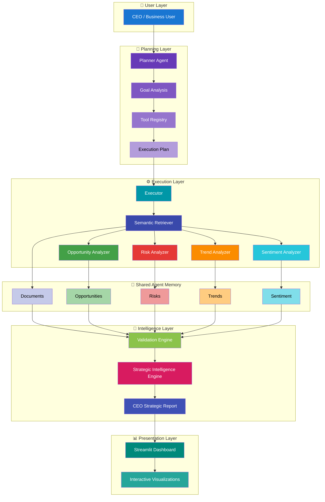
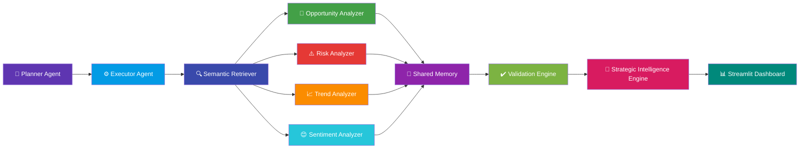
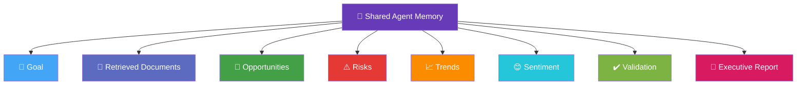
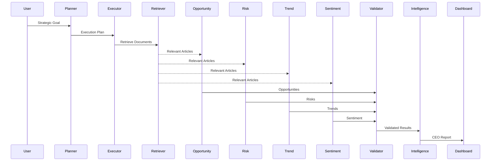

<div align="center">

# 🤖 AI CEO Strategic Intelligence Agent

### Autonomous Multi-Agent AI System for Executive Strategic Decision Intelligence

<p align="center">


</p>

---

### 🧠 Planner • Executor • Semantic Search • Multi-Agent AI • Strategic Intelligence • RAG • Executive Decision Support

Transform business news into **CEO-ready strategic intelligence reports** using **Autonomous AI Agents**, **Semantic Retrieval**, **Retrieval-Augmented Generation (RAG)** and **Local Large Language Models**.

</div>

---

# 📖 Project Overview

The **AI CEO Strategic Intelligence Agent** is an autonomous **Multi-Agent Artificial Intelligence System** that assists executive leadership in making evidence-based strategic decisions from large collections of business news.

Instead of asking a single Large Language Model to solve everything, the system divides the task into multiple specialized AI agents that collaborate through a **shared memory architecture**.

Each AI agent performs one specific responsibility:

- 🔍 Retrieve relevant information
- 🚀 Identify strategic opportunities
- ⚠ Analyze business risks
- 📈 Detect emerging trends
- 😊 Assess market sentiment
- ✔ Validate all findings
- 👔 Generate an executive strategic intelligence report

The final output is presented through an interactive **Streamlit Dashboard** designed for executive decision support.

---

# ✨ Key Features

| Category | Capability |
|-----------|------------|
| 🧠 Autonomous Planner | Dynamically creates an execution plan based on the user's strategic goal |
| ⚙ AI Executor | Executes every tool in sequence using shared memory |
| 🔍 Semantic Search | Retrieves relevant documents using FAISS vector similarity |
| 🚀 Opportunity Analysis | Identifies strategic business opportunities |
| ⚠ Risk Analysis | Detects operational and strategic risks |
| 📈 Trend Detection | Discovers emerging technologies and market trends |
| 😊 Sentiment Analysis | Evaluates article-level market sentiment |
| ✔ Validation Engine | Ensures all AI findings are evidence-based |
| 👔 Strategic Intelligence Engine | Produces CEO-ready intelligence reports |
| 📊 Executive Dashboard | Interactive visualization using Streamlit |

---

# 🎯 End-to-End AI Workflow


---

# 💡 Why a Multi-Agent Architecture?

Traditional Retrieval-Augmented Generation (RAG) systems retrieve documents and ask a single Large Language Model to generate an answer.

This project instead adopts a **Multi-Agent AI Architecture**, where independent AI agents collaborate to solve different aspects of a strategic intelligence problem.

### Benefits

- 🧠 Specialized reasoning by dedicated AI agents
- 🔄 Shared memory for inter-agent collaboration
- ✔ Evidence validation before reporting
- 📊 Explainable and transparent decision making
- 📈 Modular and extensible architecture
- 👔 Executive-focused intelligence generation

The result is a scalable and explainable AI system capable of producing high-quality strategic recommendations for executive decision makers.

---
# 🏗️ System Architecture

The AI CEO Strategic Intelligence Agent follows a **modular Multi-Agent Architecture**, where each component performs a specialized task while collaborating through a shared memory system.

The architecture is divided into five logical layers:

| Layer | Responsibility |
|--------|----------------|
| 👤 User Layer | Accepts strategic business goals from executives |
| 🧠 Planning Layer | Generates an intelligent execution plan using the Planner Agent |
| ⚙️ Execution Layer | Executes specialized AI agents sequentially |
| 🧠 Intelligence Layer | Validates insights and generates executive intelligence |
| 📊 Presentation Layer | Displays CEO-ready reports through the Streamlit dashboard |

---

## High-Level System Architecture



---

# 🧩 System Components

## 👤 User Layer

The interaction begins when an executive enters a strategic business objective through the Streamlit dashboard.

Example:

```text
Analyze NVIDIA's strategic opportunities in the AI chip market.
```

---

## 🧠 Planning Layer

The Planner Agent transforms the user's objective into a structured execution workflow.

Responsibilities:

- Analyze user intent
- Load the Tool Registry
- Select appropriate AI agents
- Generate an execution plan
- Validate workflow integrity

---

## ⚙️ Execution Layer

The Executor Agent dynamically loads and executes each AI tool.

Responsibilities:

- Import tool modules
- Execute agents sequentially
- Maintain shared memory
- Store intermediate results
- Handle execution failures

---

## 🧠 Shared Agent Memory

Instead of each AI agent working independently, all agents communicate through a centralized memory object.

Stored information includes:

- Retrieved Documents
- Strategic Opportunities
- Business Risks
- Emerging Trends
- Market Sentiment
- Validation Results
- Executive Report

This architecture enables seamless collaboration between autonomous AI agents.

---

## 👔 Intelligence Layer

The Validation Engine verifies that every generated insight is supported by retrieved evidence.

After validation, the Strategic Intelligence Engine synthesizes all validated findings into a comprehensive CEO report containing:

- Executive Summary
- Strategic Opportunities
- Strategic Risks
- Emerging Trends
- Market Sentiment
- Strategic Recommendations
- CEO Briefing

---

## 📊 Presentation Layer

The Streamlit Dashboard presents all AI-generated intelligence in an executive-friendly format.

The dashboard includes:

- Interactive KPI Cards
- Opportunity Analysis
- Risk Analysis
- Trend Analysis
- Market Sentiment
- Strategic Recommendations
- CEO Briefing
- Executive Intelligence Report

---
# 🤖 Multi-Agent Architecture

Unlike traditional Retrieval-Augmented Generation (RAG) systems that rely on a single Large Language Model, this project adopts a **Multi-Agent AI Architecture**.

Each AI agent is responsible for a specialized task while collaborating through a centralized **Shared Agent Memory**.

This modular design improves:

- 🎯 Specialization
- 🔄 Collaboration
- 📚 Explainability
- ⚡ Scalability
- ✔ Evidence-based reasoning

---

# 🧠 Multi-Agent Collaboration



---

# 🧠 Shared Agent Memory

The system uses a centralized **Shared Agent Memory** that enables communication between independent AI agents.

Instead of passing data directly between tools, each agent stores its output inside a common memory object.

Every subsequent agent reads only the information it requires.

---

## Memory Structure



---

# 🔄 Agent Execution Sequence

Every AI agent contributes one specialized capability before handing control to the next stage.



---

# ⚙️ AI Agents

| AI Agent | Responsibility | Output |
|-----------|---------------|--------|
| 🧠 Planner Agent | Analyzes the user's goal and creates an execution plan | Execution Plan |
| ⚙️ Executor Agent | Dynamically executes each AI tool | Updated Shared Memory |
| 🔍 Semantic Retriever | Retrieves relevant documents using FAISS | Relevant Articles |
| 🚀 Opportunity Analyzer | Detects strategic business opportunities | Opportunities |
| ⚠️ Risk Analyzer | Identifies strategic and operational risks | Risks |
| 📈 Trend Analyzer | Detects emerging technologies and market trends | Trends |
| 😊 Sentiment Analyzer | Classifies article-level market sentiment | Sentiment |
| ✔️ Validation Engine | Verifies every insight using supporting evidence | Validated Intelligence |
| 👔 Strategic Intelligence Engine | Generates executive strategic intelligence | CEO Report |

---

# 🎯 Why Multiple AI Agents?

Instead of assigning one Large Language Model every task, the workload is divided among specialized AI agents.

This approach offers several advantages:

| Traditional Single-Agent AI | Multi-Agent AI System |
|-----------------------------|-----------------------|
| One prompt performs every task | Specialized agents perform dedicated tasks |
| Difficult to validate outputs | Validation engine verifies every insight |
| Limited explainability | Each agent has a transparent responsibility |
| Hard to extend | New agents can be added easily |
| Monolithic architecture | Modular and scalable design |
| Single reasoning pathway | Collaborative reasoning across agents |

---

# ⭐ Key Architectural Advantages

✅ Modular AI architecture

✅ Dynamic planning and execution

✅ Shared memory communication

✅ Explainable reasoning

✅ Evidence-based validation

✅ Easy extensibility

✅ Retrieval-Augmented Generation (RAG)

✅ Executive-focused intelligence generation

---
